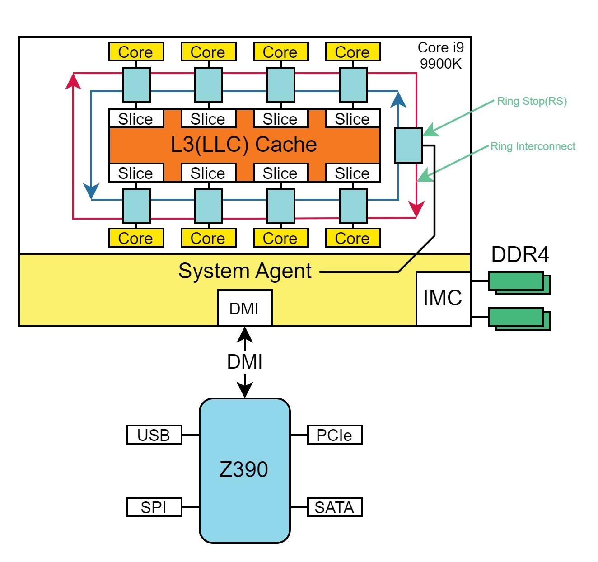
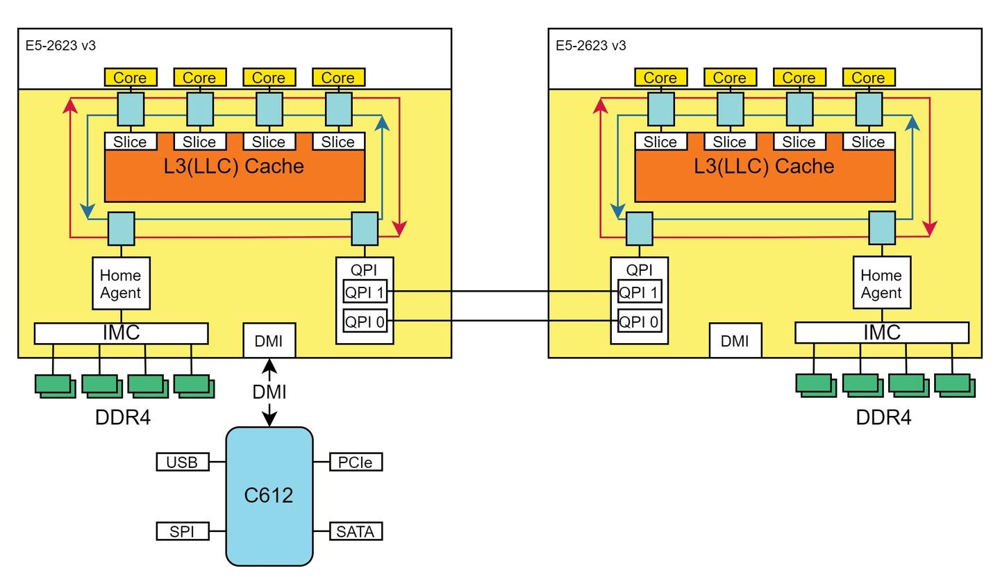
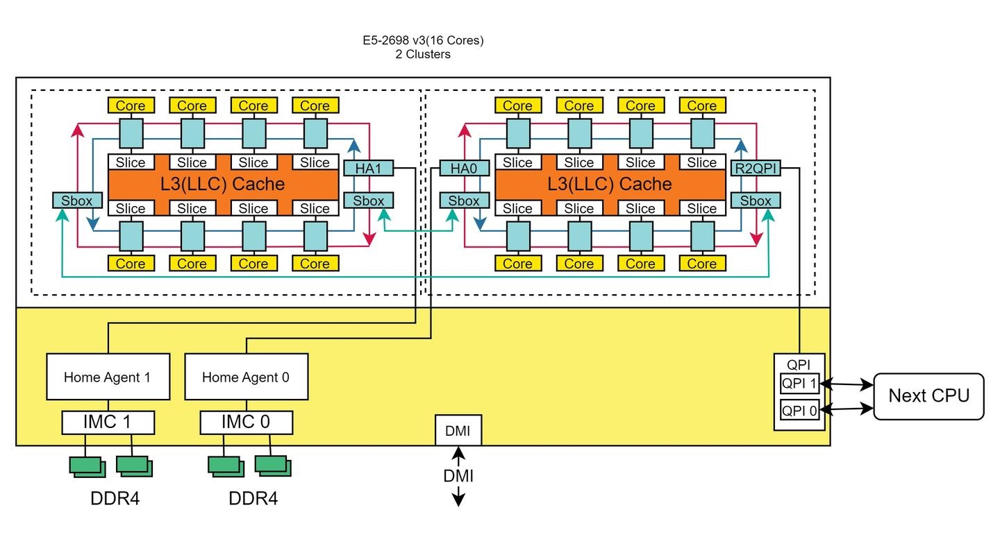
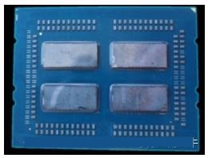
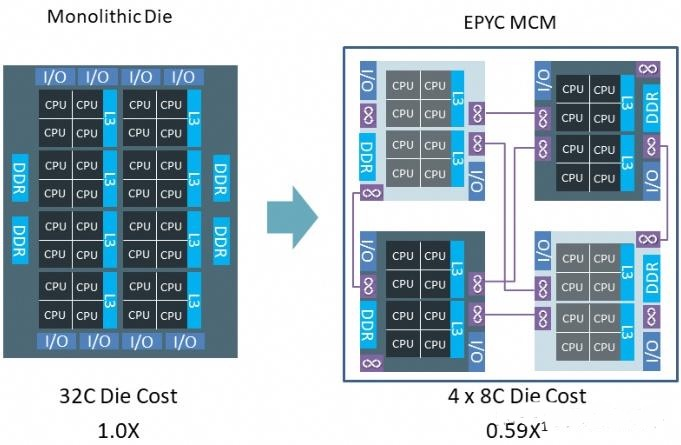

# 通用部分
本文主要介绍CPU拓扑相关的内容。一张主板上可能有一个或者两个CPU插槽，称为socket；而在一个CPU下可能又会有进一步的拓扑结构，将一个CPU又分成了一个或者多个NUMA。
# Intel
## CPU的基本构造
以Intel i9 9900K为例，基本构造：
+ 一颗CPU内有8个Core，每个Core都有一个Ring Stop，多个Core之间通过Ring总线进行通信
+ 每个Core有2MB的L3 Cache，物理上隔离，逻辑上共同组成了16 MB L3 Cache
+ CPU通过DMI（Direct Media Interface）和 PCH（Platform Controller Hub）相连，PCH又连接了USB、PCIE等
+ CPU通过IMC（Integrated Memory Controller）访问内存，内存控制器有两个通道，单通道可以连接两个DIMM

## 多CPU
为了提升单机算力，一张主板上设计了多个socket，插入多个CPU。与单socket相比，CPU上多了QPI，用于多CPU互联。每个CPU有自己的IMC，如果一颗CPU要访问另一颗CPU下的内存，需要跨过QPI。

## Cluster on Die
单CPU核数越来越多，造成Die体积越来越大，良品率降低，为此设计了Cluster on Die架构，即一颗CPU内有多个Die，按照Die将CPU划分成多个Cluster。两个Die之间通过Sbox连接，Sbox为Cache Agent Bridge，是一张Ring stop。

# AMD
## 多Die设计：MCM
AMD多Die设计称为MCM（Multichip module），多个Die之间通过Infinite fabric技术互联（AMD多socket之间也通过infinite fabric互联）。如图，一个CPU下有四个Die，每个Die内有8个核。

MCM逻辑视图：

基本结构为：
+ 一个板上有多个socket，多个socket之间通过infinite fabric连接
+ 一个socket内又有多个Die，多个Die之间通过infinite fabric连接
+ 一个Die内可能有多个CCD，也可能没有，要看是第几代架构
+ 一个CCD内有多个CCX
+ 一个CCX内有多个核，多个核共享L3 Cache
+ 一个核内2个thread，共享L2 Cache

# MCM下的NUMA结构
MCM下CPU有多个Die，Die可能又有多个CCD，每个CCD访问自己的内存通道速度快，访问其他CCD较慢。而MCM下NUMA划分即是选择将哪些内存通道进行交织。NUMA node划分的粒度越细，单个node下内存访问平均延迟越低。通过配置Node Per Socket来决定在什么粒度上进行NUMA划分：
+ NPS0:只有一个NUMA，仅对2-socket有效
+ NPS1:一个CPU划分成一个NUMA
+ NPS2:CPU划分成两个NUMA，每个NUMA四个通道交织
+ NPS4:CPU划分成四个NUMA，每个象限是一个NUMA域
+ Last-Level Cache(L3) as NUMA node：每个L3域（其实就是CCX）作为一个NUMA node